## CI/CD Architecture

```mermaid
flowchart LR

A[Developer]
B[GitHub Repository]
C[GitHub Actions]
D[Build Docker Image]
E[Push Image to Docker Hub]
F[SSH into AWS EC2]
G[Docker Compose Pull]
H[Restart Containers]
I[Nginx]
J[Flask App]
K[PostgreSQL]

A -->|git push| B
B --> C
C --> D
D --> E
E --> F
F --> G
G --> H
H --> I
I --> J
J --> K
```

### Deployment Flow

1. Developer pushes code to the **main** branch.
2. GitHub Actions starts automatically.
3. The Flask application is built into a Docker image.
4. The image is pushed to Docker Hub.
5. GitHub Actions connects securely to the AWS EC2 instance using SSH.
6. The server pulls the newest Docker image.
7. Docker Compose recreates the application container.
8. Nginx continues serving traffic while forwarding requests to the updated Flask application.
9. PostgreSQL persists application data using Docker volumes.
